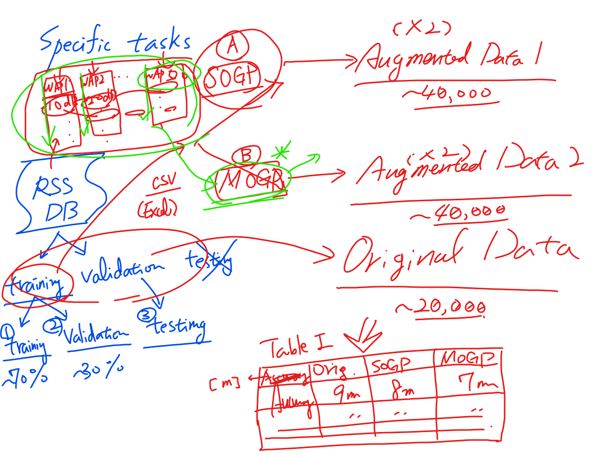
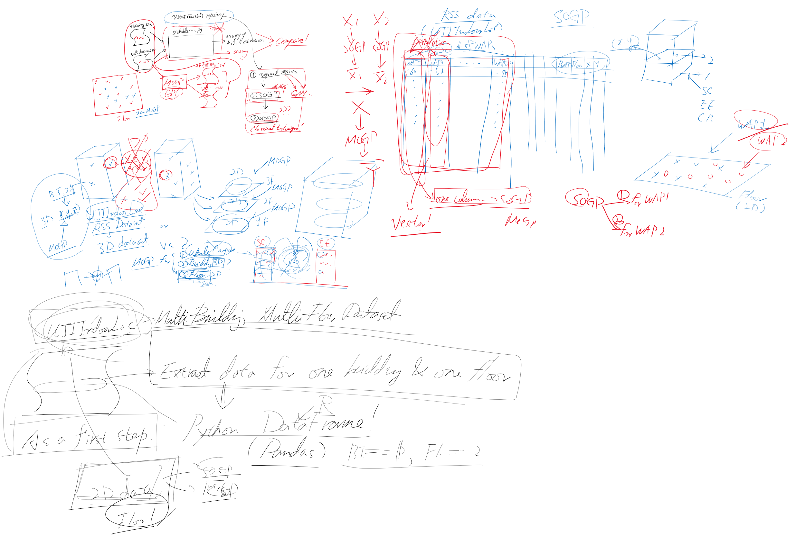
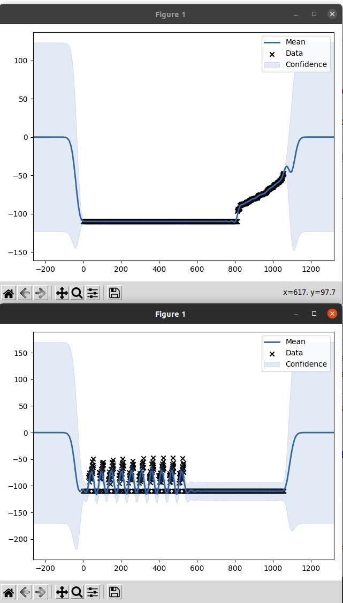
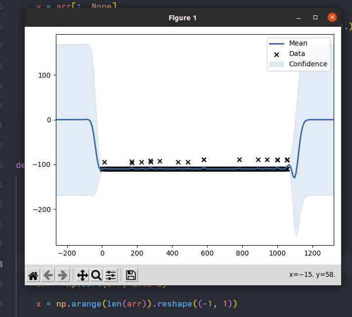

Abstract Date: 2021/9/10

Completely paper: 2021/9/15

Workshop abstract submission due: August 5, August 27, September 10, 2021 (extended, firm)
Workshop paper submission due: August 10, September 1, September 15, 2021 (extended, firm)

​    

sort and not sort (will it affect result?)

The order of data, it will affect a lot.

Q:

1. 什么是relative position？
2. 

