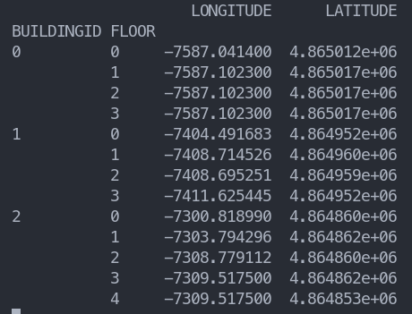

# Indoor locatization development processing


## Development

和python的后端相比，sci的开发过程很不一样，sci的开发是有很多个部分，后端开发是很多个步骤。

所以在sci的项目中，更需要的是每一个函数只有一个作用，多个函数之间的 input ouput 应该相对统一。


## Normalization

```python
z = df.loc[:, "WAP001": "WAP520"].to_numpy()
z = sklearn.preprocessing.normalize(z, norm="l2")
```

`normalization` 虽然可以让每一个特征的值都在0到1之间，这样可以让每一个特征的值都是相对独立的。但是这个操作是不可逆的。norm之后是没办法恢复原来的值。所以需要用到`standardization`。


## About the data set

Due to the data set includes 3 buildings which contain 15 floors total. And every floor there are many repeat data (same position but several different WAPs values).

The following code example is one floor. 

```python
>>> pd_raw_b_0_f_0 = pd.read_csv("building_0_floor_0.csv")
>>> pd_raw_b_0_f_0.shape
(1059, 530)
>>> df_b_0_f_0 = pd_raw_b_0_f_0.groupby(["LONGITUDE", "LATITUDE", "FLOOR", "BUILDINGID"], as_index=False).mean()
>>> df_b_0_f_0.shape
(54, 530)
>>> 1059/54
19.61111111111111
```

Therefore, there are 20 points at the same position in average. There are 1059 records and 54 position in the building 0 floor 0. 


In the all buildings and floors dataset.

```python
>>> df_raw.shape
(19937, 524)
>>> df.shape
(933, 529)
```

The all buildings and floors are 19937 records and 933 position. The file data with repeat named `campus.csv`, the file data without repeat named `campus_clean.csv` .


### From single floor to all buildings

 Analysis the dataset `campus_clean`. The source code is `src/dev/defineLim`.

```python
df = pd.read_csv("/home/aruix/aruixDAO/Code/gaussian_process/data/campus_clean.csv").filter(
    ["LONGITUDE", "LATITUDE", "BUILDINGID", "FLOOR"]).copy()
print(df.groupby(["BUILDINGID", "FLOOR"]).max())
print(df.groupby(["BUILDINGID", "FLOOR"]).min())
```

The ouput is:



Therefore, on the same the longitude and latidute are different. I need to generate points by floors.


==TODO==

1. 分building来生成数据，主要是因为limitaion。
